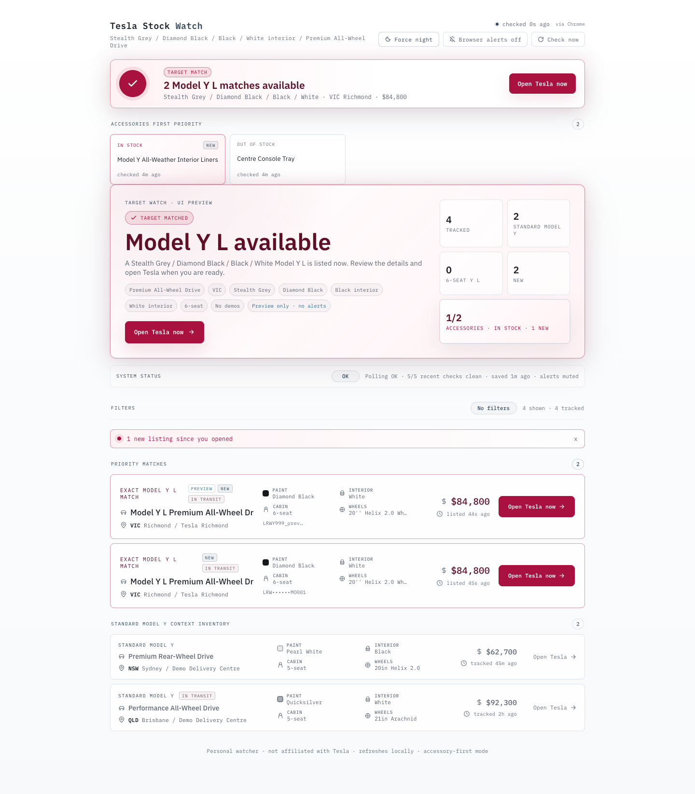
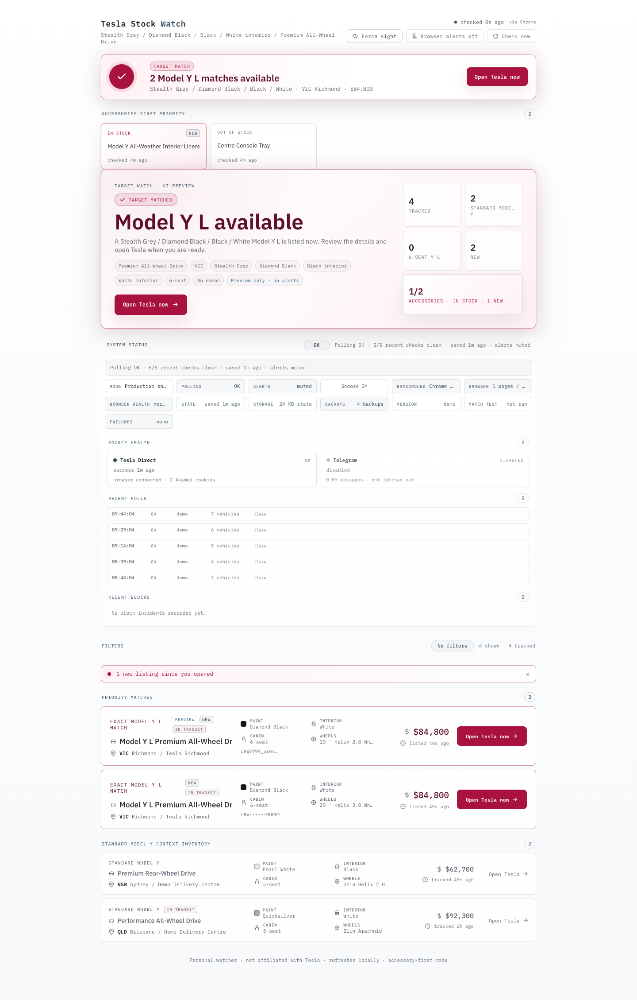
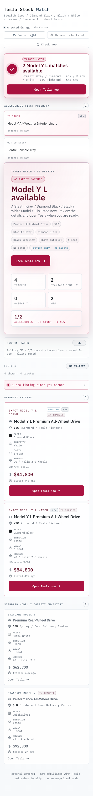

# Tesla Stock Watch

**Tesla Stock Watch** is a self-hosted Tesla inventory monitor, Model Y stock watcher, and alert dashboard for Australia. It watches Tesla inventory from your own machine or Docker host, tracks listing changes over time, and can send Pushover or Gmail SMTP alerts when matching stock appears.

[](LICENSE)
[](package.json)
[](docker-compose.yml)

Use it when you want a private Tesla availability tracker, Tesla Model Y inventory alert tool, or lightweight stock monitor that you control end to end.

It is not affiliated with Tesla. Use it responsibly: aggressive polling can get your host, browser profile, or network blocked.

## Project Note

This is an AI-assisted, vibe-coded project that was built to solve a real Tesla stock search. It is public so others can reuse, inspect, adapt, and improve it. Treat it like a practical self-hosted tool: review the code, start with alerts disabled, and tune polling conservatively for your own setup.

## At A Glance

- Self-hosted Tesla Australia inventory tracker for Model Y and Model Y L availability.
- Target matching by paint, interior, cabin, trim keywords, state, and demo status.
- Local dashboard for current inventory, priority matches, source health, and poll history.
- Optional Pushover push alerts and Gmail SMTP email notifications.
- Docker Compose setup for an always-on home server, VM, or small Linux box.
- Sanitized demo screenshots included so you can see the workflow before running it.

## Screenshots

Dashboard overview with sanitized demo data:



System health and source status:



Mobile dashboard:



## What It Does

- Monitors Tesla Australia inventory from a headed Chrome or Chromium browser session.
- Shows a local web dashboard with inventory, target matches, source health, and poll history.
- Sends optional Pushover push notifications and Gmail SMTP email alerts.
- Persists vehicle history, price changes, removals, and service health locally.
- Runs with Docker Compose on a Linux Docker host.
- Includes optional noVNC access so you can inspect the browser when Tesla shows prompts.
- Includes an optional Telegram public-channel liveness monitor as a second inventory signal.

## What It Does Not Do

- It does not buy or reserve vehicles.
- It does not bypass login, payment, CAPTCHA, or challenge flows.
- It does not require Tesla account credentials.
- It does not ship with any real alert credentials.

## Quick Start

Requirements:

- Node.js 18 or newer
- npm
- Google Chrome or Chromium for browser-based inventory checks

Run locally:

```bash
npm install
npm run build
cp .env.example .env
npm start
```

Open:

```text
http://localhost:3000/
```

By default, examples keep direct inventory polling and real alerts conservative. Edit `.env` before using this as a live monitor.

For a live vehicle stock watcher, set:

```text
DIRECT_INVENTORY_ENABLED=true
REAL_ALERTS_ENABLED=false
```

Enable `REAL_ALERTS_ENABLED=true` only after the dashboard and `/api/health` look correct.

## Docker Setup

For an always-on Tesla stock watcher, Docker is the recommended path.

Requirements:

- Linux host, VM, or small server with Docker
- Docker Compose
- Enough memory for Node plus headed Chrome

Create a private Docker config:

```bash
cp .env.docker.example .env.docker
```

Edit `.env.docker` on the Docker host:

```text
PUBLIC_HOST=<host-or-dns-name>
DIRECT_INVENTORY_ENABLED=true
REAL_ALERTS_ENABLED=false
ALERT_TESTS_ENABLED=false
```

Start the service:

```bash
docker compose up -d --build
curl http://<host>:3000/api/health
```

Open:

```text
http://<host>:3000/
```

Docker volumes:

- `tesla-stock-chrome-profile`: persistent Chrome profile and cookies
- `tesla-stock-state`: inventory state, poll logs, event logs, and backups

## Alert Setup

Alerts are optional and disabled by default in the example files. Keep them disabled until the dashboard and `/api/health` look correct.

### Pushover

1. Create or sign in to a Pushover account.
2. Copy your Pushover User Key into `PUSHOVER_USER`.
3. Create an application at `https://pushover.net/apps/build`.
4. Copy that application API Token into `PUSHOVER_TOKEN`.

### Gmail SMTP

1. Use a Gmail account with 2-Step Verification enabled.
2. Create an App Password in Google Account settings under Security.
3. Set `SMTP_USER` to the Gmail address.
4. Set `SMTP_PASS` to the generated app password.
5. Set `ALERT_EMAIL` to the recipient address.

Minimal alert configuration:

```text
REAL_ALERTS_ENABLED=false
ALERT_TESTS_ENABLED=false
PUSHOVER_USER=<pushover-user-key>
PUSHOVER_TOKEN=<pushover-app-token>
SMTP_HOST=smtp.gmail.com
SMTP_PORT=587
SMTP_USER=<gmail-address>
SMTP_PASS=<gmail-app-password>
ALERT_EMAIL=<recipient-address>
```

Test alerts:

```bash
# Set ALERT_TESTS_ENABLED=true, restart the service, then:
curl -X POST http://<host>:3000/api/test-alert
```

After testing, set `ALERT_TESTS_ENABLED=false` again. Set `REAL_ALERTS_ENABLED=true` only when you want live match and service alerts.

## Configuration Guide

Start from `.env.example` for local runs or `.env.docker.example` for Docker.

| Variable | Purpose | Default in examples |
| --- | --- | --- |
| `DIRECT_INVENTORY_ENABLED` | Enables direct Tesla inventory polling | `false` |
| `REAL_ALERTS_ENABLED` | Sends real match and service alerts | `false` |
| `ALERT_TESTS_ENABLED` | Enables `/api/test-alert` endpoints | `false` |
| `PUBLIC_HOST` | Hostname used in alert links | `localhost` |
| `MONITORED_STATES` | Comma-separated states to alert on | `VIC` |
| `ACTIVE_POLL_INTERVAL_MS` | Business-hours polling interval | `900000` |
| `QUIET_POLL_INTERVAL_MS` | Quiet-hours polling interval | `7200000` |
| `TESLA_DATA_DIR` | State and log directory | `/data/tesla-state` in Docker |
| `CHROME_USER_DATA_DIR` | Persistent Chrome profile path | `/data/chrome-profile` in Docker |
| `TELEGRAM_INVENTORY_ENABLED` | Enables optional Telegram liveness monitor | `false` |

## noVNC Browser Access

The Docker image runs headed Chrome inside a virtual display. noVNC is bound to `127.0.0.1` by default, so use an SSH tunnel:

```bash
ssh -L 6080:127.0.0.1:6080 user@host
```

Then open:

```text
http://localhost:6080/vnc.html
```

Use noVNC only to inspect benign browser prompts or browser health. Do not use it to automate or solve challenge flows.

## API Endpoints

| Endpoint | Purpose |
| --- | --- |
| `GET /api/health` | Runtime health, alert readiness, source status, browser status |
| `GET /api/inventory` | Current normalized inventory data |
| `GET /api/config` | Current target and runtime configuration |
| `GET /api/sources` | Tesla direct and Telegram source health |
| `GET /api/poll-events?limit=20` | Recent poll audit events |
| `GET /api/vehicle-events?limit=20` | Recent vehicle event audit trail |
| `POST /api/test-alert` | Sends test Pushover and email alerts when enabled |
| `POST /api/test-shop-alert` | Sends test shop/accessory alerts when enabled |

## Project Layout

| Path | Purpose |
| --- | --- |
| `server.js` | Express server, poll loop, persistence, alerting, API routes |
| `scraper-fallback.js` | Main headed Chrome inventory scraper |
| `scraper.js` | Backup scraper using `puppeteer-extra` |
| `scraper-dom.js` | Display-only DOM fallback scraper |
| `scraper-shop.js` | Tesla Shop accessory checker |
| `telegram-ingest.js` | Optional Telegram public-channel monitor |
| `app-min.jsx` | React dashboard |
| `tweaks-panel.jsx` | Dashboard settings panel |
| `data.js` | Display helpers |
| `minimal.css` | Dashboard styles |
| `scripts/build-ui.js` | Bundles frontend assets into `dist/` |
| `docker-compose.yml` | Docker Compose service definition |
| `docker-entrypoint.sh` | Starts Xvfb, window manager, noVNC, and Node |

## Development Checks

```bash
npm ci
npm audit --audit-level=moderate
npm run check
npm run build
```

The GitHub Actions workflow runs the same checks on pushes and pull requests.

## Security And Privacy

Never commit:

- `.env`, `.env.docker`, or `.env.secrets`
- Pushover tokens, Gmail app passwords, SMTP passwords, proxy credentials, or private hostnames
- Chrome profiles, cookies, browser state, private screenshots, logs, or `vehicle-state.json`
- `node_modules`, `dist`, Playwright captures, or generated output folders

Before publishing a fork or public copy:

```bash
rm -rf node_modules dist logs output .playwright-cli .playwright-mcp
rm -f .env .env.docker .env.secrets vehicle-state*.json* *.log *.png *.jpg *.jpeg *.webp
npm install
npm run build
git status --short
```

Rotate any credential that was ever stored in a local checkout before making that checkout public.

See [SECURITY.md](SECURITY.md) for more privacy guidance.

## Contributing

Bug reports and pull requests are welcome. See [CONTRIBUTING.md](CONTRIBUTING.md) before opening an issue or PR, especially if logs or screenshots are involved.

## Troubleshooting

If inventory is empty:

- Check `GET /api/health`.
- Confirm `DIRECT_INVENTORY_ENABLED=true` if you expect direct polling.
- Check whether Tesla is blocking the browser session.
- Open noVNC and inspect whether Chrome needs benign prompts dismissed.

If alerts do not send:

- Check `alertReady`, `pushoverConfigured`, `emailConfigured`, and `alertMissing` in `/api/health`.
- Confirm `ALERT_TESTS_ENABLED=true` before calling `/api/test-alert`.
- Confirm `REAL_ALERTS_ENABLED=true` before expecting live match alerts.
- Recheck the Gmail App Password and Pushover app token.

## License

MIT. See [LICENSE](LICENSE).
